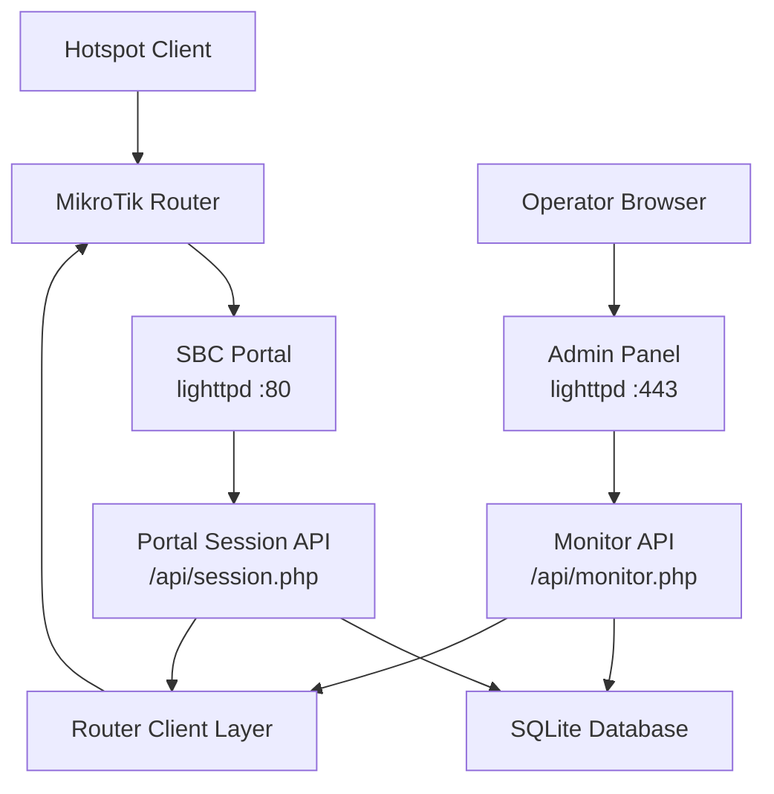
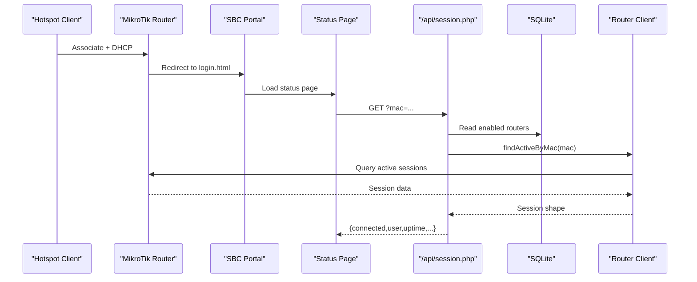
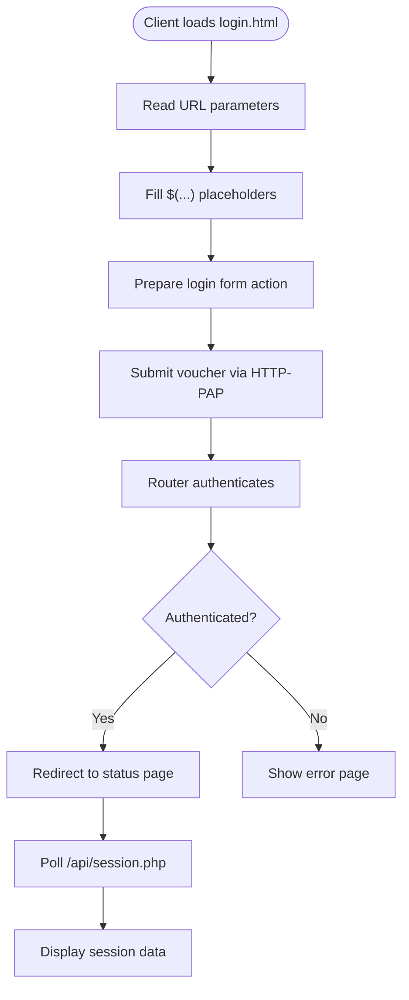
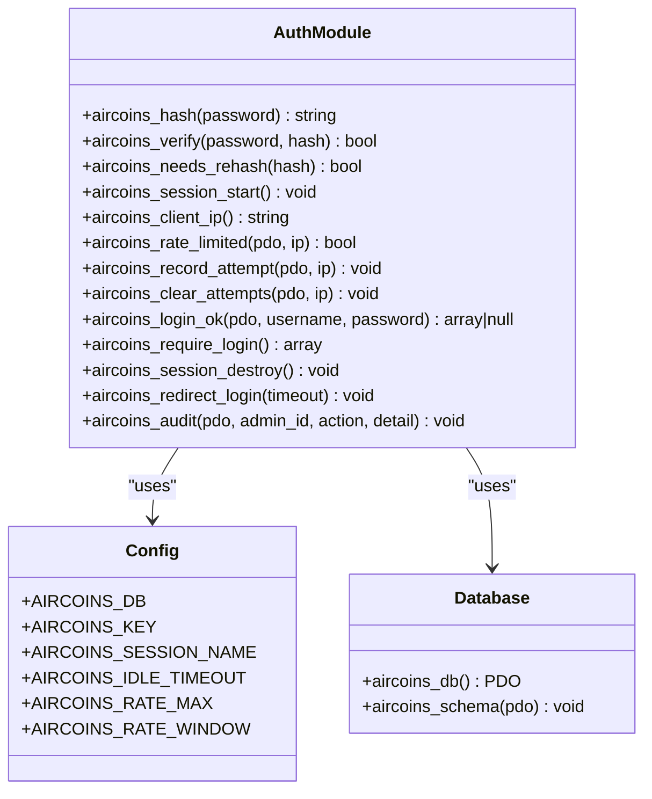
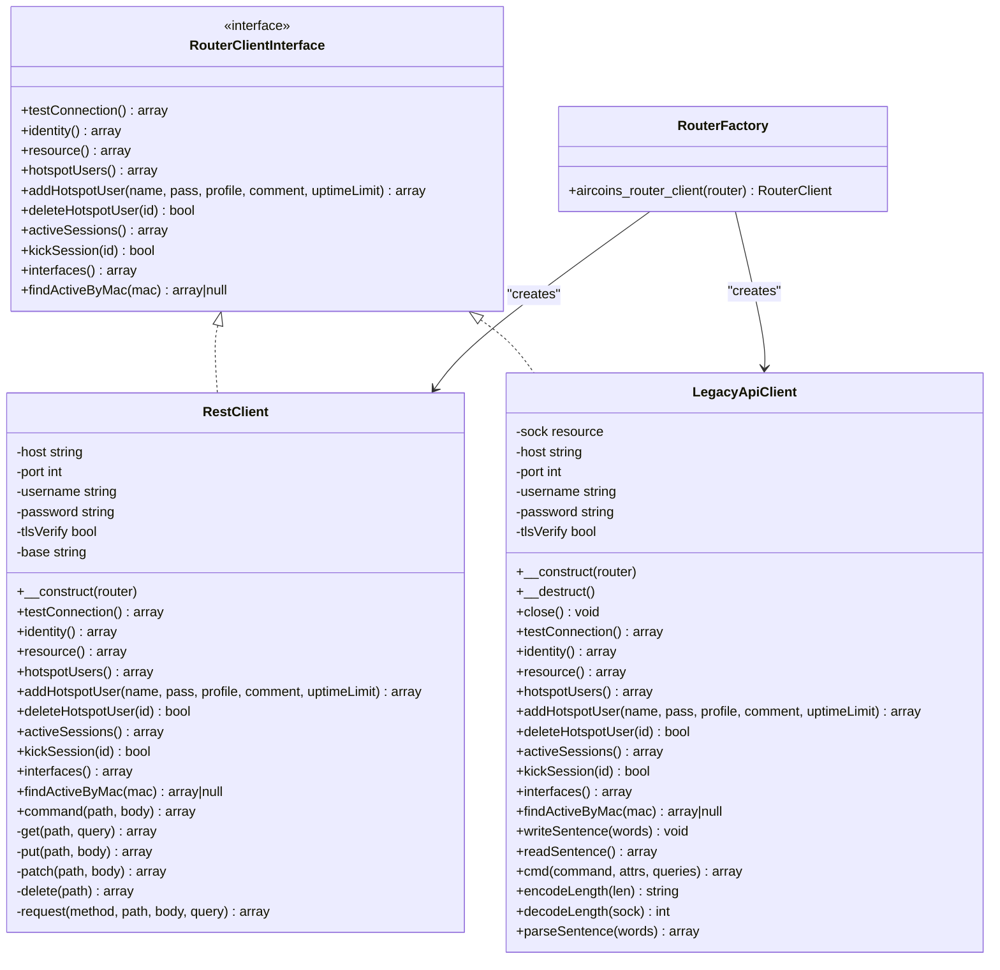
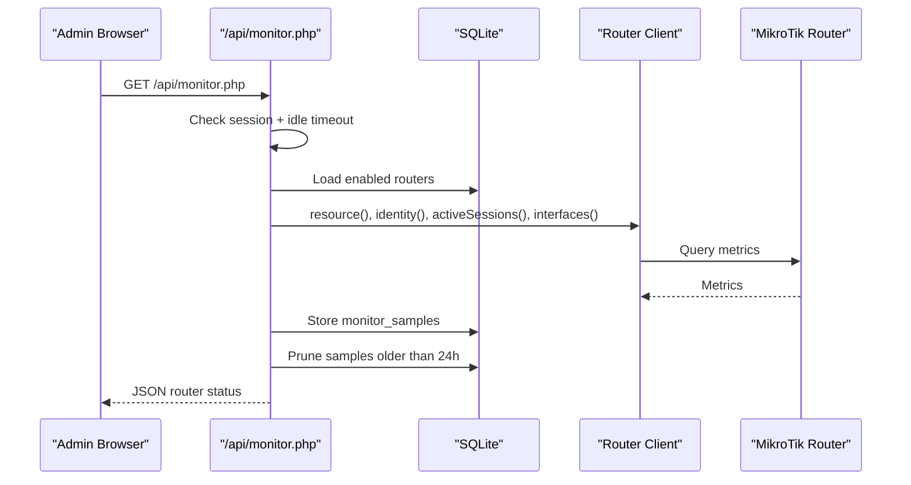
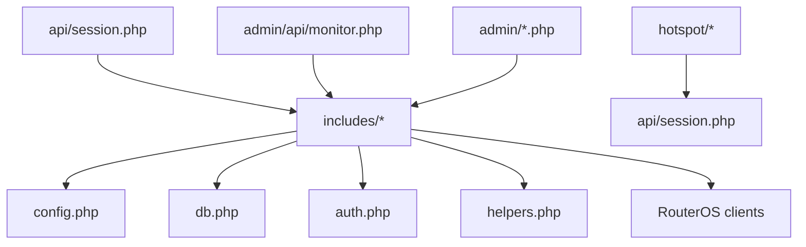

# Troubleshooting & Maintenance

<cite>
**Referenced Files in This Document**
- [DEPLOYMENT.md](file://DEPLOYMENT.md)
- [config.php](file://includes/config.php)
- [db.php](file://includes/db.php)
- [auth.php](file://includes/auth.php)
- [helpers.php](file://includes/helpers.php)
- [session.php](file://api/session.php)
- [monitor.php](file://admin/api/monitor.php)
- [RestClient.php](file://includes/RouterOS/RestClient.php)
- [LegacyApiClient.php](file://includes/RouterOS/LegacyApiClient.php)
- [RouterFactory.php](file://includes/RouterOS/RouterFactory.php)
- [login.html](file://hotspot/login.html)
- [status.html](file://hotspot/status.html)
- [varbridge.js](file://hotspot/js/varbridge.js)
- [api.json](file://hotspot/api.json)
</cite>

## Table of Contents
1. [Introduction](#introduction)
2. [Project Structure](#project-structure)
3. [Core Components](#core-components)
4. [Architecture Overview](#architecture-overview)
5. [Detailed Component Analysis](#detailed-component-analysis)
6. [Dependency Analysis](#dependency-analysis)
7. [Performance Considerations](#performance-considerations)
8. [Troubleshooting Guide](#troubleshooting-guide)
9. [Maintenance Procedures](#maintenance-procedures)
10. [Disaster Recovery and Health Monitoring](#disaster-recovery-and-health-monitoring)
11. [Escalation Paths and Support Resources](#escalation-paths-and-support-resources)
12. [Conclusion](#conclusion)

## Introduction
This document provides comprehensive troubleshooting and maintenance guidance for the MT-CONTROLLER-PISOWIFI system, also known as AIRCOINS NETFI. It focuses on diagnosing installation problems, captive portal connectivity issues, authentication failures, API communication errors, database performance bottlenecks, and operational maintenance tasks such as log analysis, database cleanup, backup and recovery, system updates, capacity planning, and disaster recovery.

The system consists of:
- A captive portal served by lighttpd on port 80.
- An admin panel served by lighttpd over TLS on port 443.
- A portal session JSON endpoint at `/api/session.php`.
- Router integration through MikroTik REST or Legacy API.
- SQLite-based persistence for admin accounts, routers, audit logs, login attempts, and monitor samples.

## Project Structure
The repository is organized into clear functional areas:
- `hotspot/` contains the captive portal HTML, assets, and client-side logic.
- `admin/` contains the operator UI and protected endpoints.
- `api/` contains the public-facing session lookup endpoint.
- `includes/` contains shared PHP logic, including configuration, database access, authentication, helpers, and RouterOS clients.
- `deploy/` contains deployment scripts, lighttpd configuration, php-fpm pool configuration, MikroTik RouterOS script, and update utilities.
- `router-stubs/` contains thin RouterOS pages that redirect to the SBC portal.



**Diagram sources**
- [DEPLOYMENT.md:32-70](file://DEPLOYMENT.md#L32-L70)
- [session.php:1-20](file://api/session.php#L1-L20)
- [monitor.php:1-17](file://admin/api/monitor.php#L1-L17)
- [db.php:15-48](file://includes/db.php#L15-L48)

**Section sources**
- [DEPLOYMENT.md:508-558](file://DEPLOYMENT.md#L508-L558)

## Core Components
The core components are:
- Configuration constants for database path, encryption key, session name, idle timeout, and rate limiting.
- SQLite persistence layer with schema creation and connection management.
- Authentication and session handling with Argon2id/bcrypt hashing, CSRF protection, rate limiting, and audit logging.
- RouterOS client abstraction supporting REST (v7) and Legacy (v6/v7) APIs.
- Portal session API returning live session status for a MAC address.
- Admin monitor API providing router health, resource usage, active sessions, and interface traffic rates.

Key responsibilities:
- `includes/config.php`: Centralized constants.
- `includes/db.php`: PDO singleton, WAL mode, busy timeout, schema creation.
- `includes/auth.php`: Login verification, session hardening, rate limiting, audit logging.
- `includes/helpers.php`: JSON response helper, escaping, formatting utilities.
- `api/session.php`: Unauthenticated read-only session lookup.
- `admin/api/monitor.php`: Authenticated live monitoring feed.
- `includes/RouterOS/RestClient.php`: REST API client.
- `includes/RouterOS/LegacyApiClient.php`: Legacy binary API client.
- `includes/RouterOS/RouterFactory.php`: Factory selecting client type and decrypting passwords.

**Section sources**
- [config.php:15-43](file://includes/config.php#L15-L43)
- [db.php:15-48](file://includes/db.php#L15-L48)
- [auth.php:17-57](file://includes/auth.php#L17-L57)
- [helpers.php:22-38](file://includes/helpers.php#L22-L38)
- [session.php:1-20](file://api/session.php#L1-L20)
- [monitor.php:1-17](file://admin/api/monitor.php#L1-L17)
- [RestClient.php:1-18](file://includes/RouterOS/RestClient.php#L1-L18)
- [LegacyApiClient.php:1-16](file://includes/RouterOS/LegacyApiClient.php#L1-L16)
- [RouterFactory.php:1-28](file://includes/RouterOS/RouterFactory.php#L1-L28)

## Architecture Overview
The end-to-end flow involves:
1. Client associates with the hotspot and receives DHCP.
2. Router intercepts HTTP and serves a stub redirecting to the SBC portal.
3. The SBC portal loads and uses client-side logic to prepare the login form.
4. The user submits a voucher; the router authenticates via HTTP-PAP.
5. On success, the router redirects to the SBC status page.
6. The status page polls `/api/session.php` for live session data.
7. The admin panel monitors routers via `/api/monitor.php`.



**Diagram sources**
- [DEPLOYMENT.md:174-183](file://DEPLOYMENT.md#L174-L183)
- [session.php:50-106](file://api/session.php#L50-L106)
- [RestClient.php:171-179](file://includes/RouterOS/RestClient.php#L171-L179)
- [LegacyApiClient.php:547-555](file://includes/RouterOS/LegacyApiClient.php#L547-L555)

## Detailed Component Analysis

### Captive Portal Flow
The captive portal relies on RouterOS template tags and client-side bridging:
- `hotspot/login.html` is the main entry point.
- `hotspot/js/varbridge.js` reads query parameters and fills RouterOS placeholders.
- `hotspot/status.html` polls `/api/session.php`.
- `hotspot/api.json` provides captive portal metadata from RouterOS.

Common issues:
- Missing or incorrect `$(...)` tokens in URLs.
- Incorrect SBC IP in router stubs.
- Walled garden not allowing port 80.
- IP binding missing, causing redirect loops.



**Diagram sources**
- [DEPLOYMENT.md:174-183](file://DEPLOYMENT.md#L174-L183)
- [login.html](file://hotspot/login.html)
- [varbridge.js](file://hotspot/js/varbridge.js)
- [status.html](file://hotspot/status.html)
- [api.json:1-12](file://hotspot/api.json#L1-L12)

**Section sources**
- [DEPLOYMENT.md:174-183](file://DEPLOYMENT.md#L174-L183)
- [api.json:1-12](file://hotspot/api.json#L1-L12)

### Admin Authentication and Rate Limiting
Admin authentication uses:
- Argon2id with bcrypt fallback.
- CSRF-protected forms.
- Per-IP rate limiting based on `login_attempts`.
- Audit logging for privileged actions.
- Idle session timeout.



**Diagram sources**
- [auth.php:17-281](file://includes/auth.php#L17-L281)
- [config.php:15-43](file://includes/config.php#L15-L43)
- [db.php:15-48](file://includes/db.php#L15-L48)

**Section sources**
- [auth.php:17-281](file://includes/auth.php#L17-L281)
- [config.php:15-43](file://includes/config.php#L15-L43)

### Router API Communication
The system supports two router API types:
- REST API for RouterOS v7 over HTTPS.
- Legacy API for RouterOS v6/v7 over TCP 8728 or TLS 8729.

Both implement a common interface for identity, resource, hotspot users, active sessions, interface stats, and MAC-based session lookup.



**Diagram sources**
- [RestClient.php:24-415](file://includes/RouterOS/RestClient.php#L24-L415)
- [LegacyApiClient.php:22-622](file://includes/RouterOS/LegacyApiClient.php#L22-L622)
- [RouterFactory.php:29-55](file://includes/RouterOS/RouterFactory.php#L29-L55)

**Section sources**
- [RestClient.php:1-415](file://includes/RouterOS/RestClient.php#L1-L415)
- [LegacyApiClient.php:1-622](file://includes/RouterOS/LegacyApiClient.php#L1-L622)
- [RouterFactory.php:1-56](file://includes/RouterOS/RouterFactory.php#L1-L56)

### Portal Session API
The portal session API:
- Accepts a MAC address parameter.
- Normalizes it to canonical format.
- Iterates enabled routers.
- Queries each router for an active session.
- Returns a standardized JSON payload.

```mermaid
flowchart TD
Start(["GET /api/session.php?mac=..."]) --> ValidateMAC["Normalize MAC"]
ValidateMAC --> ValidMAC{"Valid MAC?"}
ValidMAC --> |No| ReturnError["Return {connected:false,error}]
ValidMAC --> |Yes| LoadRouters["Load enabled routers"]
LoadRouters --> IterateRouters["Iterate routers"]
IterateRouters --> QuerySession["Query findActiveByMac(mac)"]
QuerySession --> Found{"Session found?"}
Found --> |Yes| BuildResponse["Build session response"]
Found --> |No| NextRouter["Try next router"]
NextRouter --> IterateRouters
BuildResponse --> End(["Return JSON"])
ReturnError --> End
```

**Diagram sources**
- [session.php:33-106](file://api/session.php#L33-L106)

**Section sources**
- [session.php:1-107](file://api/session.php#L1-L107)

### Admin Monitor API
The admin monitor API:
- Requires authenticated admin session.
- Reads router configuration.
- Fetches identity, resource, active sessions, and interfaces.
- Computes per-interface traffic rates.
- Stores monitor samples and prunes old data.



**Diagram sources**
- [monitor.php:29-187](file://admin/api/monitor.php#L29-L187)

**Section sources**
- [monitor.php:1-188](file://admin/api/monitor.php#L1-L188)

## Dependency Analysis
The system has clear dependency boundaries:
- Portal and admin pages depend on shared includes.
- API endpoints depend on database and router clients.
- Router clients depend on network connectivity and RouterOS services.
- Authentication depends on database and configuration.



**Diagram sources**
- [config.php:1-44](file://includes/config.php#L1-L44)
- [db.php:1-117](file://includes/db.php#L1-L117)
- [auth.php:1-282](file://includes/auth.php#L1-L282)
- [helpers.php:1-97](file://includes/helpers.php#L1-L97)
- [session.php:1-107](file://api/session.php#L1-L107)
- [monitor.php:1-188](file://admin/api/monitor.php#L1-L188)

**Section sources**
- [config.php:1-44](file://includes/config.php#L1-L44)
- [db.php:1-117](file://includes/db.php#L1-L117)
- [auth.php:1-282](file://includes/auth.php#L1-L282)
- [helpers.php:1-97](file://includes/helpers.php#L1-L97)
- [session.php:1-107](file://api/session.php#L1-L107)
- [monitor.php:1-188](file://admin/api/monitor.php#L1-L188)

## Performance Considerations
Performance characteristics include:
- SQLite with WAL mode and synchronous NORMAL for reduced disk writes.
- php-fpm ondemand pool with limited children to conserve RAM.
- Lighttpd serving static portal content directly.
- Router API timeouts set to prevent long hangs.
- Monitor samples pruned automatically every 24 hours.

Optimization tips:
- Ensure SQLite runs on reliable storage (eMMC or endurance microSD).
- Avoid enabling excessive access logging on flash storage.
- Keep php-fpm worker count low unless under heavy load.
- Use REST API for v7 routers when possible for cleaner JSON handling.
- Monitor CPU and memory usage via the admin dashboard.

[No sources needed since this section provides general guidance]

## Troubleshooting Guide

### Installation Problems
Symptoms:
- Port 80 already in use.
- lighttpd fails to start.
- PHP-FPM socket missing.
- Certificate permissions incorrect.

Checks:
- Verify ports 80 and 443 are free.
- Validate lighttpd configuration syntax.
- Confirm php-fpm pool socket path matches configuration.
- Check certificate file permissions and existence.

**Section sources**
- [DEPLOYMENT.md:475-505](file://DEPLOYMENT.md#L475-L505)

### Connectivity Issues
Symptoms:
- Client does not redirect to portal.
- Portal loads but cannot reach router.
- Redirect loops occur.

Checks:
- Verify walled garden allows SBC IP on port 80.
- Confirm IP binding bypasses hotspot interception for SBC.
- Ensure router stubs contain correct SBC IP.
- Test RouterOS service availability (REST 443 or Legacy 8728/8729).

**Section sources**
- [DEPLOYMENT.md:380-390](file://DEPLOYMENT.md#L380-L390)
- [DEPLOYMENT.md:485-493](file://DEPLOYMENT.md#L485-L493)

### Authentication Failures
Symptoms:
- Admin login blocked after multiple failures.
- Router credentials rejected.
- Session expires unexpectedly.

Checks:
- Review login attempt counter and rate limit window.
- Verify admin password hash algorithm compatibility.
- Check RouterOS user permissions and service enablement.
- Ensure system time is synchronized.

**Section sources**
- [auth.php:103-189](file://includes/auth.php#L103-L189)
- [DEPLOYMENT.md:502](file://DEPLOYMENT.md#L502)

### API Communication Errors
Symptoms:
- REST returns 401, 415, 404, or 400.
- Legacy API returns `!trap` or `!fatal`.
- Session API returns `connected:false`.

Checks:
- For REST: verify Basic auth, Content-Type, path format, and verb usage.
- For Legacy: verify service enablement and port accessibility.
- For session API: verify MAC parameter, enabled routers, and `/api/` alias.

**Section sources**
- [DEPLOYMENT.md:485-499](file://DEPLOYMENT.md#L485-L499)
- [session.php:50-106](file://api/session.php#L50-L106)

### Database Operations
Symptoms:
- Slow queries.
- Database lock warnings.
- Monitor samples growing indefinitely.

Checks:
- Verify WAL mode and busy timeout settings.
- Ensure monitor sample pruning is running.
- Check SQLite file permissions and disk space.

**Section sources**
- [db.php:36-48](file://includes/db.php#L36-L48)
- [monitor.php:164-167](file://admin/api/monitor.php#L164-L167)

## Maintenance Procedures

### Log Analysis
Focus areas:
- PHP-FPM error logs for application errors.
- Audit log for administrative actions.
- Login attempts table for brute-force detection.
- Monitor samples for traffic trends.

Recommended commands:
- Tail PHP-FPM logs.
- Query recent audit entries.
- Count failed login attempts per IP.
- Export monitor samples for analysis.

**Section sources**
- [DEPLOYMENT.md:554](file://DEPLOYMENT.md#L554)
- [db.php:92-116](file://includes/db.php#L92-L116)
- [auth.php:111-138](file://includes/auth.php#L111-L138)

### Database Cleanup
Tasks:
- Prune old login attempts.
- Prune monitor samples older than 24 hours.
- Archive or rotate audit logs if needed.
- Vacuum SQLite periodically to reclaim space.

Automation:
- Use cron jobs for periodic cleanup.
- Leverage existing prune logic in monitor API.

**Section sources**
- [auth.php:117-126](file://includes/auth.php#L117-L126)
- [monitor.php:164-167](file://admin/api/monitor.php#L164-L167)

### Backup and Recovery
Backup targets:
- SQLite database file.
- Encryption key file.
- lighttpd configuration.
- php-fpm pool configuration.
- Router stubs and portal customizations.

Recovery steps:
- Restore database and key file with correct permissions.
- Reapply web server configurations.
- Restart services.
- Verify admin login and router connectivity.

**Section sources**
- [DEPLOYMENT.md:552-554](file://DEPLOYMENT.md#L552-L554)

### System Updates
Update process:
- Pull latest repository changes.
- Run update portal script to sync files.
- Restart php-fpm only if includes, admin, or api changed.
- Validate lighttpd configuration.

**Section sources**
- [DEPLOYMENT.md:453-470](file://DEPLOYMENT.md#L453-L470)

## Disaster Recovery and Health Monitoring

### Disaster Recovery
Scenarios:
- SBC hardware failure.
- Database corruption.
- Encryption key loss.
- Router configuration drift.

Procedures:
- Maintain offsite backups of database and encryption key.
- Document router configuration baseline.
- Test recovery procedures regularly.
- Plan for manual router credential re-entry if key is lost.

**Section sources**
- [DEPLOYMENT.md:564](file://DEPLOYMENT.md#L564)

### Health Monitoring Strategies
Metrics to track:
- Router online status.
- Active session count.
- Interface traffic rates.
- CPU and memory usage.
- Uptime and version.

Tools:
- Admin dashboard for real-time monitoring.
- External monitoring systems polling `/api/monitor.php`.
- Alerting on router offline or high error rates.

**Section sources**
- [monitor.php:106-187](file://admin/api/monitor.php#L106-L187)

## Escalation Paths and Support Resources

### Internal Escalation
- Level 1: Operator checks basic connectivity and logs.
- Level 2: Network engineer verifies RouterOS configuration and services.
- Level 3: Developer reviews PHP code, API behavior, and database integrity.

### External Support
- MikroTik support for RouterOS-specific issues.
- Linux distribution support for OS-level problems.
- Hardware vendor support for SBC issues.

### Documentation References
- Deployment guide for architecture and troubleshooting.
- Code comments in API and client implementations.
- RouterOS documentation for API endpoints.

**Section sources**
- [DEPLOYMENT.md:473-505](file://DEPLOYMENT.md#L473-L505)

## Conclusion
This troubleshooting and maintenance guide covers the full lifecycle of the MT-CONTROLLER-PISOWIFI system, from installation and connectivity diagnostics to authentication, API communication, database operations, and operational maintenance. By following the structured checks, diagrams, and procedures provided, operators can quickly identify and resolve issues, maintain system health, and plan for scalability and disaster recovery.

[No sources needed since this section summarizes without analyzing specific files]